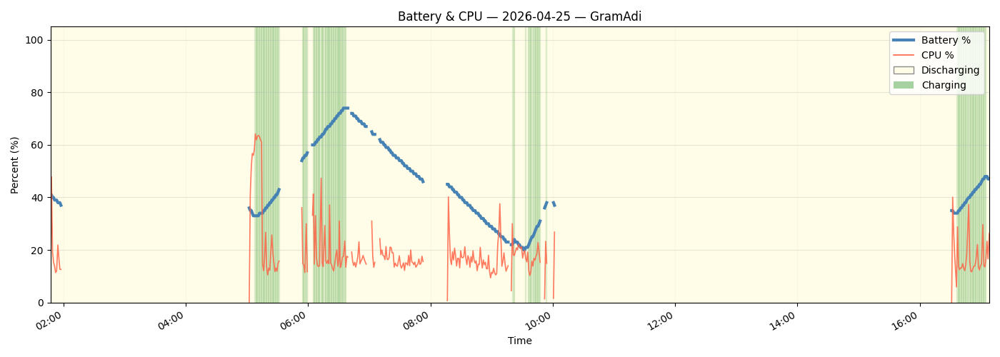

# 🔋 Laptop Battery Monitor

A lightweight Windows 11 system-tray application that monitors battery level, WiFi signal strength, CPU usage, and disk space — and sends Telegram alerts when thresholds are exceeded.

---

## Features

- **System tray icon** — shows battery % with colour coding (green = charging, yellow = on battery)
- **WiFi signal tray icon** — second tray icon showing current signal in dBm; background colour codes quality (see ranges below); hover for legend
- **Low-battery Telegram alerts** — fires when battery drops below a configurable threshold; repeats on a configurable interval until resolved
- **Battery-recovered notification** — sent when the laptop is plugged back in or battery rises above threshold
- **Daily disk space check** — checks all local drives at a configurable time and alerts if any drive exceeds a usage threshold
- **Daily battery & CPU graph** — interactive window (opens maximised) with zoom/pan and cursor readout; Today and Yesterday graphs accessible from tray menu; also sent automatically via Telegram at midnight and on startup
- **CSV data logging** — records battery %, CPU %, WiFi signal (dBm & %), Memory Pressure Index (MPI), charging state every N seconds; auto-rotated after a configurable retention period
- **Settings UI** — all thresholds, intervals and Telegram config editable at runtime without restarting
- **Memory Pressure Index (MPI)** — composite 0–100% score logged and plotted on the graph; tracks when the system struggles with memory (see interpretation table below)
- **Telegram remote query** — send `info <hostname>` from Telegram desktop to get a live stats snapshot + today's and yesterday's graphs on demand (see section below)

### Memory Pressure Index (MPI)

A composite 0–100% score derived from Windows `GetPerformanceInfo` (same source as Task Manager). Higher = more memory pressure.

| MPI | Meaning |
|-----|---------|
| 0–30 | Normal — system comfortable |
| 30–60 | Moderate — noticeable on heavy workloads |
| 60–80 | High — slowdowns, active paging likely |
| 80–100 | Critical — system is struggling |

The MPI is a weighted combination of four factors:

| Factor | Weight | What it measures |
|--------|--------|------------------|
| Available memory | 40% | Low available RAM is the most direct signal of impending hard paging |
| Commit ratio | 30% | Virtual memory promised to processes vs. commit limit (RAM + page file) |
| Cache depletion | 15% | Healthy systems keep ~25% RAM as file cache; cache collapse drives disk I/O |
| Non-Paged Pool | 15% | Kernel memory that cannot be evicted; abnormal growth crowds out user space |
- **Custom window icon** — graph window uses `laptop_battery_monitor.ico` instead of the default Tk feather

---

### Telegram Remote Query

While the monitor is running, send the following message from your Telegram account to the bot:

```
info GramAdi
```

Replace `GramAdi` with the exact hostname of your machine (case-insensitive). The monitor will respond with:

| Response | Content |
|----------|---------|
| Stats message | Battery %, charge state, time remaining, WiFi signal, MPI, CPU %, disk usage for all drives |
| Yesterday's graph | Daily battery/CPU/WiFi/MPI chart as an image |
| Today's graph | Same for the current day |

**Security**: the bot only responds to the `chat_id` configured in `telegram-send.conf`. Messages from any other chat are silently ignored.

A 15-second cooldown prevents duplicate responses if the command is sent rapidly.


| dBm | Quality |
|-----|---------|
| ≥ −55 | Excellent |
| ≥ −65 | Good |
| ≥ −75 | Fair |
| < −75 | Poor |

The WiFi icon uses the Windows Native WiFi API (`wlanapi.dll`) via `ctypes` — no `netsh` process, no geolocation, no "Location in use" tray notification.

---

## Screenshots

### Daily Battery & CPU Graph



### Telegram — Startup message

> Replace with your own screenshot: `docs/telegram_startup.png`


### Telegram — Low-battery alert

> Replace with your own screenshot: `docs/telegram_alert.png`


### Telegram — Disk space alert

> Replace with your own screenshot: `docs/telegram_disk.png`


---

## Installation

```powershell
# 1. Clone the repository
git clone https://github.com/Adrian-Rosoga/laptop-battery-monitor
cd laptop-battery-monitor

# 2. Create and activate a virtual environment
python -m venv .venv
.venv\Scripts\Activate.ps1

# 3. Install dependencies
python -m pip install --upgrade pip
python -m pip install -r requirements.txt
```

---

## Telegram Setup

The app uses [telegram-send](https://github.com/rahiel/telegram-send) for notifications.

```powershell
# Configure once (links the tool to your bot/chat)
telegram-send --configure

# Or specify a custom config path
telegram-send --configure --config C:\Bin\Run\telegram-send.conf
```

Set the config path in the **Settings** window (`telegram_conf`), or leave it blank to auto-detect `telegram-send.conf` in the same folder as the script/executable.

---

## Configuration

All settings are stored in `monitor_config.json` next to the executable. They can be edited via the **Settings** tray menu or directly in the file.

| Key | Default | Description |
|-----|---------|-------------|
| `threshold` | `20` | Battery % at which low-battery alerts fire |
| `interval` | `1` | Battery check interval in seconds |
| `resend_minutes` | `5` | How often to re-send the low-battery alert while still low |
| `telegram_enabled` | `false` | Enable/disable all Telegram messages |
| `telegram_conf` | `null` | Path to `telegram-send.conf`; auto-detected if blank |
| `data_log_interval` | `60` | How often to write a CSV row (seconds) |
| `data_log_retention_days` | `30` | CSV/log files older than this are deleted on startup |
| `disk_alert_enabled` | `true` | Enable daily disk-space Telegram alert |
| `disk_alert_threshold` | `90` | Drive usage % that triggers an alert |
| `disk_alert_time` | `"07:00"` | Local time (24 h, `HH:MM`) to run the disk check |
| `logging_enabled` | `false` | Write a dated log file (`battery_monitor_YYYY-MM-DD.log`) |

Example `monitor_config.json`:

```json
{
  "threshold": 30,
  "interval": 1,
  "resend_minutes": 5,
  "telegram_enabled": true,
  "telegram_conf": "C:\\Bin\\Run\\telegram-send.conf",
  "data_log_interval": 60,
  "data_log_retention_days": 30,
  "disk_alert_enabled": true,
  "disk_alert_threshold": 90,
  "disk_alert_time": "07:00",
  "logging_enabled": false
}
```

---

## Running

```powershell
# Run from source
python laptop_battery_monitor.py

# Or launch the pre-built executable
.\MyDist\laptop_battery_monitor.exe
```

Monitoring starts automatically. Left-click the tray icon to open the live graph.

---

## Building a Standalone Executable

```powershell
python -m pip install pyinstaller

python -m PyInstaller --onefile --noconsole --icon=laptop_battery_monitor.ico `
    -n laptop_battery_monitor laptop_battery_monitor.py

# Copy to your preferred location
Copy-Item dist\laptop_battery_monitor.exe MyDist\
```

---

## Telegram Message Examples

**Startup:**
```
[GramAdi]
▶️ Battery Monitor v2.1.

Battery 40% (Alert at 30%) - Charging
C: at 89.7% - 95.8 GB free of 929 GB
D: at 44.2% - 264.3 GB free of 476 GB
```

**Low-battery alert:**
```
[GramAdi]
🚨🚨🚨🚨🚨🚨🚨🚨🚨🚨
🪫 Battery low: 15% (Alert at 20%) - Discharging
🚨🚨🚨🚨🚨🚨🚨🚨🚨🚨
```

**Disk space alert:**
```
[GramAdi]
🚨🚨🚨🚨🚨🚨🚨🚨🚨🚨
💾 Drive C: at 91% (Threshold alert 90%) - 95.8 GB free of 929 GB
🚨🚨🚨🚨🚨🚨🚨🚨🚨🚨
```

---

## Dependencies

| Package | Purpose |
|---------|---------|
| [pystray](https://github.com/moses-palmer/pystray) | System tray icon(s) |
| [Pillow](https://python-pillow.org/) | Icon image generation |
| [psutil](https://github.com/giampaolo/psutil) | Battery, CPU, disk info |
| [telegram-send](https://github.com/rahiel/telegram-send) | Telegram notifications |
| [plyer](https://github.com/kivy/plyer) | Windows desktop notifications |
| [matplotlib](https://matplotlib.org/) | Battery & CPU graphs |
| tkinter | Settings and graph windows (bundled with Python) |

---

## License

MIT
